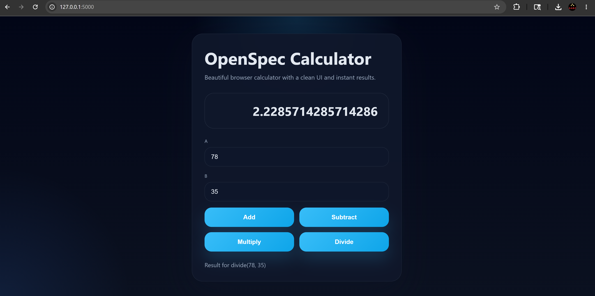
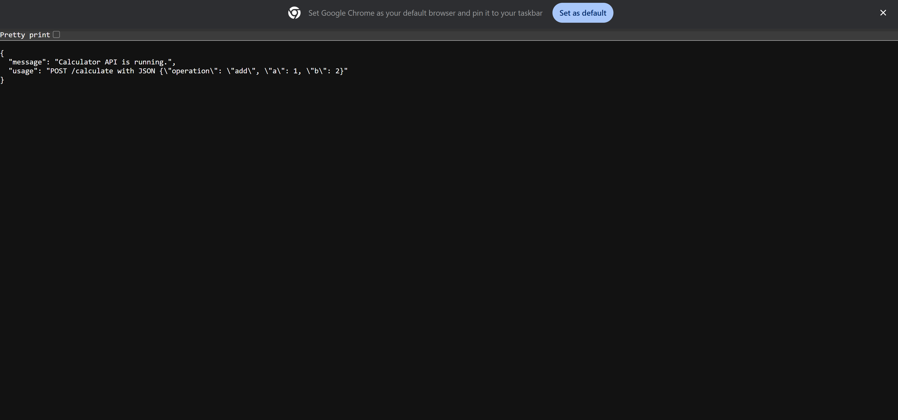

# OpenSpec_Calculator
Calculator app done using Vibe Coding for the IITM Workshop  Spec Driven Software Development

## OpenSpec
This project now includes a beautiful user-facing calculator webpage as well as the existing API.

- Visit `http://localhost:5000/` to access the calculator UI with buttons and instant results.
- Use `POST /calculate` to call the calculator API programmatically.

## UI

## API

